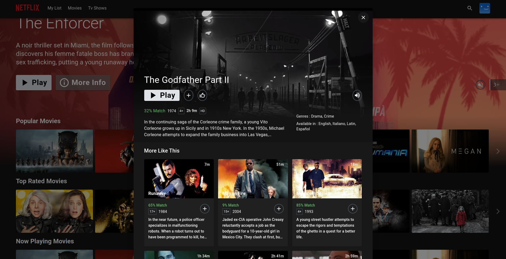

# 🎬 Netflix Clone - Full DevOps Deployment Project  
🚀 Project Overview
This project showcases a full DevOps pipeline to develop, secure, monitor, and deploy a Netflix clone web application on a cloud-native infrastructure.  
The application is containerized, automatically built and tested via CI/CD, scanned for vulnerabilities, monitored for performance, and deployed on a Kubernetes cluster using GitOps principles.  
🛠️ Tech Stack & Tools Used  
- Frontend/Backend: Netflix Clone Web Application
- Containerization: Docker
- CI/CD: Jenkins
- Security Scanning: SonarQube (Code Quality), Trivy (Image Vulnerability Scanning)
- Monitoring: Prometheus, Grafana
- Orchestration: Kubernetes (EKS - AWS)
- GitOps Deployment: ArgoCD
- Cloud Provider: AWS
- Version Control: Git, GitHub

🔥 Project Highlights  
- Built and containerized the Netflix clone application using Docker.
- Configured a complete CI/CD pipeline in Jenkins for automated build, test, and deployment.
- Integrated SonarQube and Trivy for proactive code quality assurance and security checks.
- Deployed application on a Kubernetes cluster managed via AWS EKS.
- Implemented GitOps principles using ArgoCD for declarative, automated deployment.
- Set up system and application monitoring with Prometheus and visualized metrics using Grafana dashboards.

🧩 Project Architecture  
### GitHub Repo ➔ Jenkins CI/CD ➔ SonarQube & Trivy Scan ➔ Docker Build ➔ Kubernetes Deployment via ArgoCD ➔ AWS Cloud Infrastructure ➔ Monitoring via Prometheus & Grafana  

📸 Screenshots  

 

